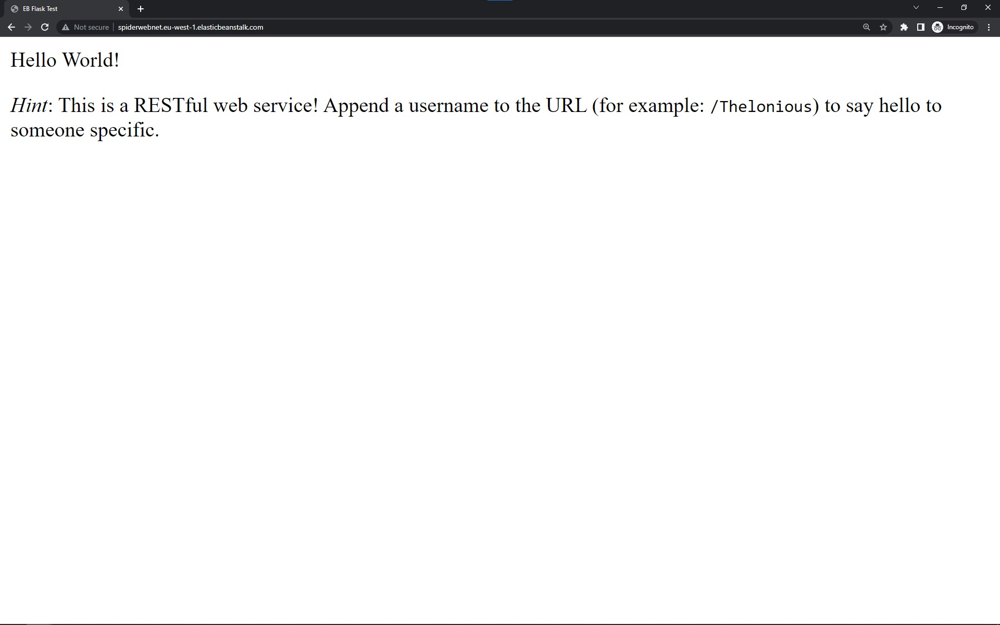
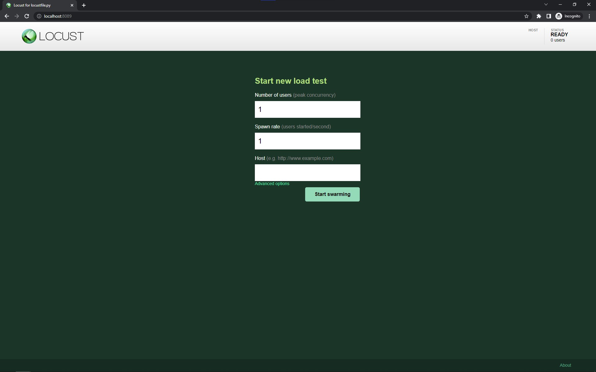

# Network Distributed Systems Assignment 2

## Assignment outline

> In this CA, you are required to implement a cloud-based hosting solution for a Flask based Python application (Python Anywhere).
> A series of stress tests should then be performed using Locust.
> The idea is to test with a slowly increasing number of users to identify when the server will break. This will validate how many users the server can deal with at any one time.
> We are interested to see if any changes happen when more users are added to the virtual tests.
> Eventually the server will start responding with error codes telling us that it cannot take any more traffic.

## Hosted on AWS EC2 using Elastic Beanstalk and CodePipeline

Check it out here: [http://spiderwebnet.eu-west-1.elasticbeanstalk.com/](http://spiderwebnet.eu-west-1.elasticbeanstalk.com/)

## How to Run the Flask app

Install requirements:

```bash
pip install -r requirements.txt
```

Set up the virtual environment:

```bash
pip install virtualenv
virtualenv venv

# Activate on Windows
Venv\Scripts\activate

# Activate on Linux
source venv/bin/activate
```

Run the Flask app:

```bash
flask --app application.py run
```

Then navigate to <http://localhost:5000>

### Home

The flask application is a simple template restful application that allows you to append to the URL to customise the page.



To deactivate the virtual environment:

```bash
deactivate
```

## How to run Locust tests

---

### 1. Install Locust

To install locust, run the following command:

```bash
pip install locust
```

### 2. Start Locust

To start locust, navigate to the test folder `cd test` and run the following command:

```bash
locust
```

Then navigate to <http://localhost:8089>

You should see this page:



### 3. Run the tests

To run the tests, enter the following values:

- Number of total users to simulate: `100` (or any number of users you want)
- spawn rate: `10` (or any number you want to spawn users per second)
- Host to test:
  - if local `http://localhost:5000`
  - if hosted on AWS `http://spiderwebnet.eu-west-1.elasticbeanstalk.com`

Then click `Start Swarming`

---

## Links to resources

### Virtual Environments

- <https://www.freecodecamp.org/news/how-to-setup-virtual-environments-in-python/>
- <https://docs.python.org/3/library/venv.html>

### Hosting on AWS

1. <https://www.red-gate.com/simple-talk/blogs/deploying-a-nodejs-application-from-github-to-aws-elastic-beanstalk-and-creating-a-ci-cd-aws-codepipeline/>

2. <https://aws.amazon.com/elasticbeanstalk/>

3. <https://aws.amazon.com/codepipeline/>

4. <https://flask.palletsprojects.com/en/2.3.x/deploying/>

5. <https://leonardqmarcq.com/posts/github-actions-cicd-elastic-beanstalk>

6. <https://cloudbytes.dev/aws-academy/run-flask-apps-on-elastic-beanstalk>

### Locust Testing

- <https://www.youtube.com/watch?v=Uai2yZWfM9g>
